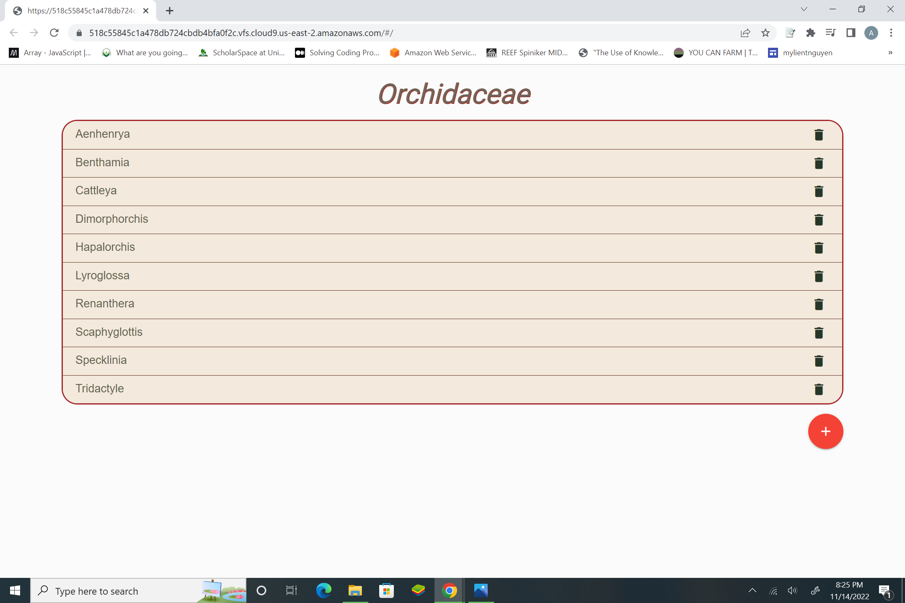
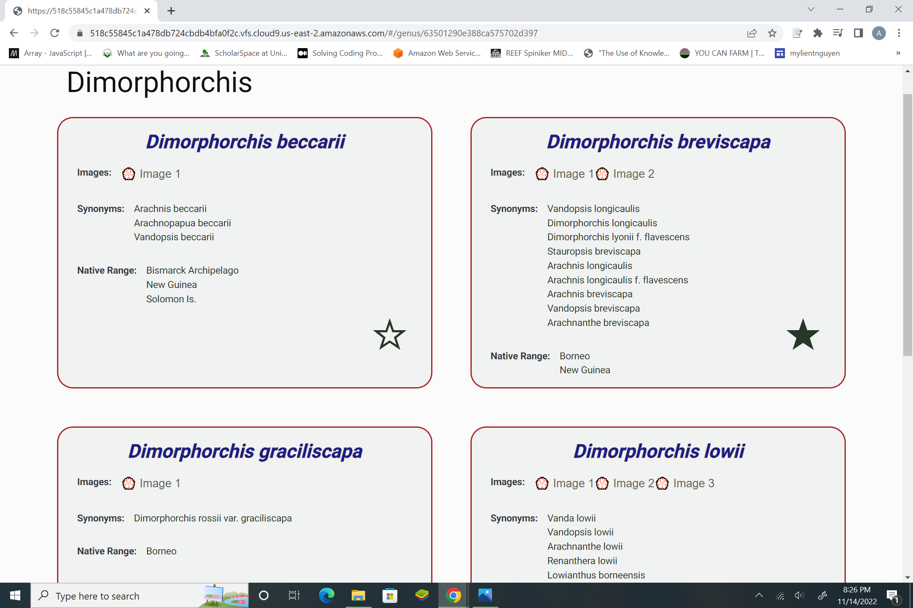
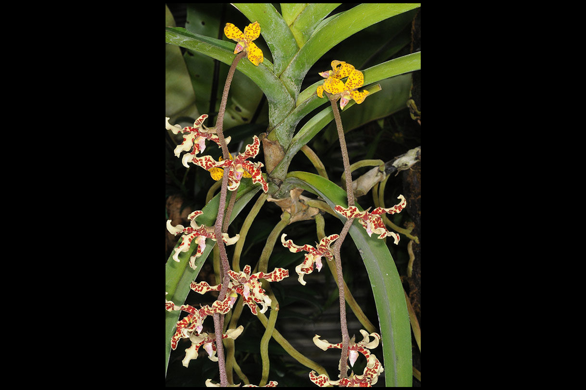

# View genera and species from Kew Plants of the World Database

## Description

A basic app created using NodeJS, Express, MongoDB, GraphQL, Apollo and React 

This app randomly generates genera and related species information using the PyKew Library from the [Kew RBG Plants of the World Database](powo.science.kew.org) and allows users to view species information, add genera, delete genera and add their own species. I chose the family **Orchidaceae** for the number of species and the variety of showy forms and colors of orchid flowers. However, any family name could be dropped into the **data.py** file to modify the plant family
### Technologies

* Node-16.17.0
* Express-4.16.4
* GraphQL-14.3.0
* React-16.8.6

### Setup

Clone and install :

```
git clone https://github.com/alsullivan14/Plant-Species-App.git
npm install
```

Create a cluster in MongoDB Atlas and add connection string in your server.js file where prompting MONGO_URI = '' and pykew/data.py where prompting MongoClient()
Use test database or your own and add genus and species collections. Add database name to path in connection strings

### Running the application:

Run using:

```npm start```

Add data with command:

```python data.py``` from inside pykew folder

In browser app will be running on [https://localhost:3000/](http://localhost:3000/)

### Features

* Add, delete genera
* Display all genera 
* Add species to genus
* View species info such as **images**, **synonyms** and **native_range** 
* Star species
* Load data into MongoDB using PyKew API

Genera page


Species page


View species images


### Structure

#### Server directory
[http://localhost:3000/graphql](http://localhost:3000/graphql)

**server.js** - This is the main file for running the server of backend. This file contains all the required modules, establish the mongoose connection and GraphQL connection.

**models** - This folder contains mongoose **genus** and **species** schema model that represents set of information's for genus and species records in database.

**schema** - This schema folder contains the GraphQL logic. The schema/schema.js exports all the types and mutations
- **GraphQL Types** : GraphQL schema to specify the types for API using GraphQL schema language. **genus_type.js** and **species_type.js** are the types that define user schema.
- **GraphQL Queries** : **schema/root_query_type.js** file includes a simple GraphQl query and mongoose query used inside to retrieve genera/species list of data from mongodb database.
- **GraphQL Mutation**: Inside **mutations.js** file are 4 methods addGenus, addSpeciesToGenus, starSpecies and deleteGenus. Add methods creates new genus/species, star method updates the starred status of species, delete method deletes the record.

#### Client directory
[http://localhost:4000](http://localhost:4000)

**index.js** - Apollo Client to establish connection to GraphQL Server API, And Routing with React

**queries** - Apollo GraphQL queries using `graphql-tag`. Graphql Tag uses JavaScript template literal tag to parse GraphQL queries.

**components** - Component folder consist of files for creating genera/species, stars and deleting genus. `react-apollo` used to connect components and pass **mutations** and **queries** defined using `graphql-tag`

### Credit
Credit to [John Iacona](https://github.com/jiacona) for [PyKew Library](https://github.com/RBGKew/pykew.git)

